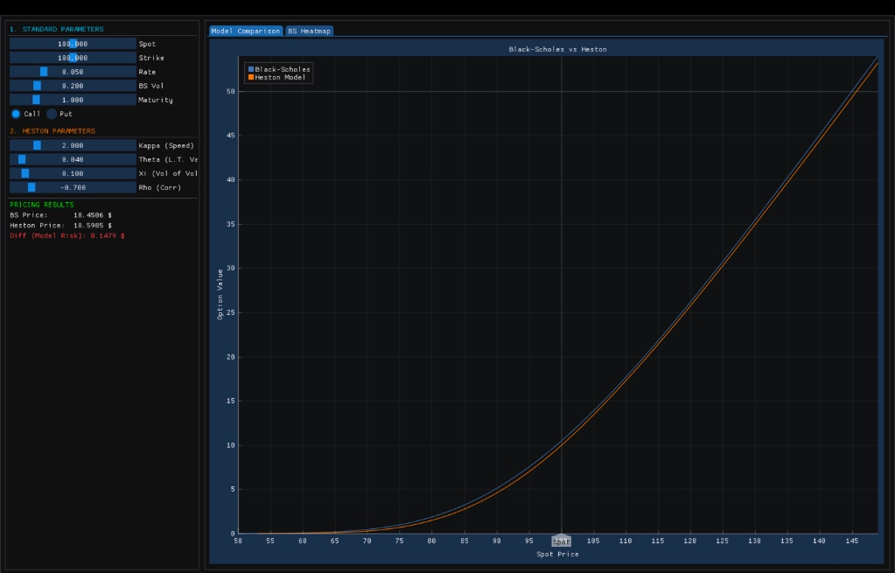
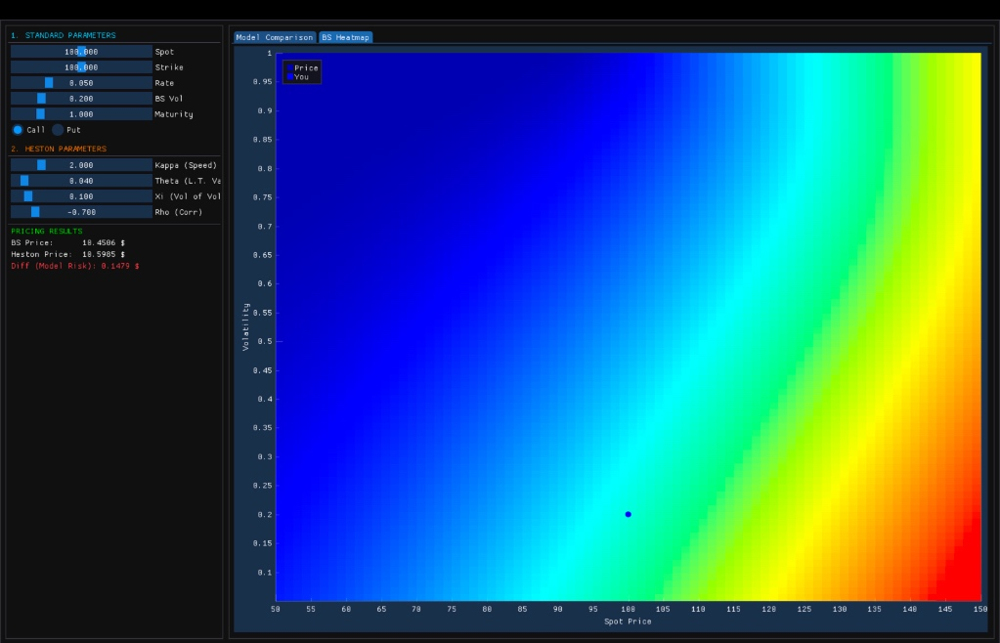

# C++ Quantitative Option Pricing & Risk Engine

Implementation of a high-performance derivatives pricing engine combining analytical (Black-Scholes) and numerical (Monte Carlo, Heston) methods with real-time OpenGL visualization.

---
## Application Gallery


*Real-time Model Comparison (Heston vs Black-Scholes) and Market Parameters Control.*

<br>


*3D Risk Surface Visualization (Spot vs Volatility Heatmap).*

---

## Project Objective

Develop a low-latency pricing engine capable of handling complex stochastic volatility models (Heston) in real-time, visualizing the "Volatility Smile," and computing Greeks with high precision using parallel computing.

**Key Result:** achieved ~90 million simulation steps per second using OpenMP, reducing pricing latency to ~12ms for complex path-dependent models.

---

## Performance Benchmarks

Running on mac / Standard x64 CPU:

| Metric | Value | Note |
|:-------|:------|:-----|
| **Black-Scholes Throughput** | > 30M ops/sec | Closed-form analytical formula |
| **Monte Carlo Latency** | ~12 ms | 1 Million paths (OpenMP enabled) |
| **Convergence Rate** | O(1/√N) | Standard Error reduction |
| **Precision Gain** | ~3.0x | Using Antithetic Variates |
| **Parallel Efficiency** | ~7.5x | speedup on 8-core CPU |

---

## Methodology

### 1. Pricing Models
- **Black-Scholes-Merton**: Analytical implementation for rapid benchmarking.
- **Heston Stochastic Volatility**: Time-Stepping Monte Carlo (Euler-Maruyama) to capture market skew and kurtosis.
- **Implied Volatility Solver**: Newton-Raphson algorithm to reverse-engineer market parameters from prices.

### 2. Numerical Techniques
- **Monte Carlo Simulation**: Generation of stochastic paths for underlying assets (S_t) and volatility (v_t).
- **Variance Reduction**: Implementation of Antithetic Variates to minimize standard error without increasing computational cost.
- **Finite Differences**: Calculation of Greeks (Δ, Γ, V, Θ, ρ) using Common Random Numbers (CRN) for stability.

### 3. High-Performance Computing
- **Multithreading**: Full parallelization of the Monte Carlo loop using OpenMP.
- **Memory Management**: Stack-allocated vectors and efficient random number generation (Mersenne Twister) to minimize latency.

### 4. Visualization
- **Real-Time Rendering**: Integration of OpenGL and Dear ImGui for zero-latency UI.
- **3D Heatmaps**: Dynamic visualization of the Option Price Surface (Spot vs. Volatility).

---

## Technologies Used

- **C++17** - Core logic and memory management.
- **OpenMP** - Parallel computing and multithreading.
- **CMake** - Build system and dependency management (FetchContent).
- **OpenGL / GLFW** - Graphics rendering backend.
- **Dear ImGui / ImPlot** - GPU-accelerated plotting and GUI.

---

## Project Structure

```
Cpp-Option-Pricing-Engine/
│
├── include/
│   ├── BlackScholes.h      # Analytical pricing formulas
│   ├── HestonMC.h          # Stochastic Volatility MC Engine
│   ├── MonteCarlo.h        # Standard MC Engine with OpenMP
│   └── Option.h            # Base classes for Instruments
│
├── src/                    # Source Code & Test Implementations
│   ├── benchmark_performance.cpp
│   ├── gui_main.cpp        # Main GUI Entry Point
│   ├── main.cpp            # CLI Entry Point
│   ├── test_antithetic.cpp
│   ├── test_blackscholes.cpp
│   ├── test_greeks.cpp
│   ├── test_implied_vol.cpp
│   └── test_montecarlo.cpp
│
├── tests/                  # Unit Tests & Benchmarks
│   ├── test_bs.cpp         # Black-Scholes logic verification
│   ├── test_mc.cpp         # Monte Carlo convergence tests
│   ├── test_antithetic.cpp # Variance reduction verification
│   ├── test_greeks.cpp     # Analytical vs Numerical Greeks
│   ├── test_iv.cpp         # Implied Volatility solver tests
│   └── benchmark.cpp       # Latency & Throughput measurements
│
├── docs/                   # Screenshots
├── CMakeLists.txt          # Build Configuration
└── README.md
```

---

## Installation and Usage

### Prerequisites
- CMake (3.14+)
- C++ Compiler (Clang, GCC, or MSVC)
- OpenMP

### Installation

**1. Clone the repository**
```bash
git clone https://github.com/[your-username]/Cpp-Option-Pricing-Engine.git
cd Cpp-Option-Pricing-Engine
```

**2. Build the project**
```bash
mkdir build && cd build
cmake ..
make
```

**3. Launch the Dashboard**
```bash
./TradingApp
```

---

## Key Concepts

| Concept | Explanation |
|:--------|:------------|
| **Stochastic Volatility** | Model where volatility is not constant but follows its own random process (Heston). |
| **Antithetic Variates** | A variance reduction technique that pairs a path Z with its inverse −Z. |
| **Euler-Maruyama** | A method for the approximate numerical solution of a stochastic differential equation (SDE). |
| **Volatility Skew** | The difference in implied volatility for options with different strike prices (captured by Heston). |
| **OpenMP** | API that supports multi-platform shared-memory multiprocessing programming in C++. |

---

## Theory Implementation

The project solves the Heston Dynamics SDEs:

$$dS_t = \mu S_t dt + \sqrt{v_t} S_t dW_t^S$$

$$dv_t = \kappa(\theta - v_t) dt + \xi \sqrt{v_t} dW_t^v$$

Where correlation $\rho = \text{Corr}(dW_t^S, dW_t^v)$.

---

## Strengths & Limitations

### Strengths:
- **Industrial Performance**: Written in optimized C++ with parallelization.
- **Model Versatility**: Compares constant vol (BS) vs stochastic vol (Heston) in real-time.
- **Visual Insight**: Heatmaps provide immediate intuition on risk surfaces.

### Limitations (Future Roadmap):
- **American Options**: Currently supports European exercise only (requires Longstaff-Schwartz).
- **Exotics**: Barrier and Asian options are not yet implemented.
- **Live Data**: Currently uses simulated parameters instead of a live market feed.

---

## Resources and References

- Heston, S. L. (1993). "A Closed-Form Solution for Options with Stochastic Volatility".
- Glasserman, P. (2003). "Monte Carlo Methods in Financial Engineering".
- OpenMP Architecture Review Board. "OpenMP Application Program Interface".
